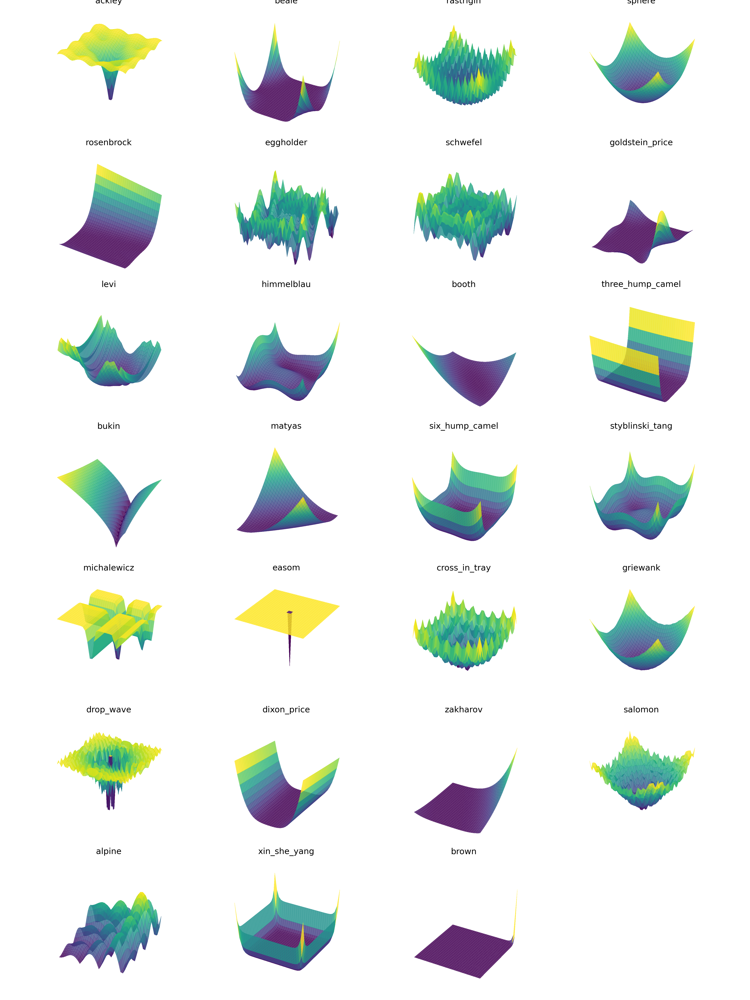

# Optimization Benchmark Functions

This repository provides a simple implementation of popular optimization benchmark functions. You can use them to test optimization algorithms and visualize the functions.

## Usage

To use the benchmark functions, import the `BF` class from `benchmark.py` and create an instance with the desired function name. You can then call the `calc` method with an input array, use `plot` to visualize the function, or retrieve the function itself with `get_function`.

~~~~python
import numpy as np
from benchmark import BF

# Create an instance of the benchmark function
bf = BF("ackley")

# Calculate the function value at a given point
y = bf.evaluate(np.array([1, 1]))
print(y)

# Plot the function
bf.plot()
# or specify the number of points for the plot
bf.plot(num_points=32)

# Get the function itself
f = bf.get_function()
y = f(np.array([1, 1]))
print(y)
~~~~

## Command Line Usage

You can also use the provided benchmark.py script to calculate and visualize benchmark functions from the command line.

~~~bash
> python benchmark.py --function ackley --x0 0 --x1 1
~~~

Or just visualize the function:

~~~bash
> python benchmark.py --function ackley
~~~

