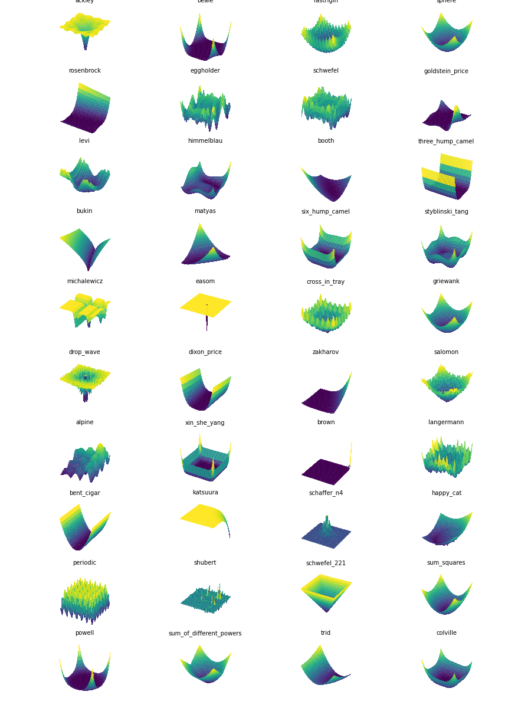

# Optimization Benchmark Functions

This repository provides a simple implementation of popular optimization benchmark functions. You can use them to test optimization algorithms and visualize the functions.

| Function Name           | Formula                                       | Range                       | Optimal Value |
|-------------------------|-----------------------------------------------|-----------------------------|---------------|
| ackley                  | -20 * exp(-0.2 * sqrt(0.5 * (x^2 + y^2))) - exp(0.5 * (cos(2*pi*x) + cos(2*pi*y))) + 20 + exp(1) | [-32.768, 32.768] | 0 at (0, 0) |
| beale                   | (1.5 - x + x*y)^2 + (2.25 - x + x*y^2)^2 + (2.625 - x + x*y^3)^2 | [-4.5, 4.5] | 0 at (3, 0.5) |
| rastrigin               | 20 + x^2 - 10 * cos(2*pi*x) + y^2 - 10 * cos(2*pi*y) | [-5.12, 5.12] | 0 at (0, 0) |
| sphere                  | x^2 + y^2                                     | [-5.12, 5.12] | 0 at (0, 0) |
| rosenbrock              | 100 * (y - x^2)^2 + (1 - x)^2                 | [-5, 10] | 0 at (1, 1) |
| eggholder               | -(y + 47) * sin(sqrt(abs(y + x/2 + 47))) - x * sin(sqrt(abs(x - (y + 47)))) | [-512, 512] | -959.6407 at (512, 404.2319) |
| schwefel                | 418.9829 * 2 - x * sin(sqrt(abs(x))) - y * sin(sqrt(abs(y))) | [-500, 500] | 0 at (420.9687, 420.9687) |
| goldstein_price         | (1 + (x + y + 1)^2 * (19 - 14*x + 3*x^2 - 14*y + 6*x*y + 3*y^2)) * (30 + (2*x - 3*y)^2 * (18 - 32*x + 12*x^2 + 48*y - 36*x*y + 27*y^2)) | [-2, 2] | 3 at (0, -1) |
| levi                    | sin(3*pi*x)^2 + (x - 1)^2 * (1 + sin(3*pi*y)^2) + (y - 1)^2 * (1 + sin(2*pi*y)^2) | [-10, 10] | 0 at (1, 1) |
| himmelblau              | (x^2 + y - 11)^2 + (x + y^2 - 7)^2             | [-5, 5] | 0 at (3, 2), (-2.8051, 3.1313), (-3.7793, -3.2832), (3.5844, -1.8481) |
| booth                   | (x + 2*y - 7)^2 + (2*x + y - 5)^2             | [-10, 10] | 0 at (1, 3) |
| three_hump_camel        | 2*x^2 - 1.05*x^4 + x^6/6 + x*y + y^2           | [-5, 5] | 0 at (0, 0) |
| bukin                   | 100 * sqrt(abs(y - 0.01*x^2)) + 0.01 * abs(x + 10) | [-15, -3], [-5, 3] | 0 at (-10, 1) |
| matyas                  | 0.26 * (x^2 + y^2) - 0.48 * x * y             | [-10, 10] | 0 at (0, 0) |
| six_hump_camel          | (4 - 2.1*x^2 + x^4/3) * x^2 + x*y + (-4 + 4*y^2) * y^2 | [-3, 3], [-2, 2] | -1.0316 at (0.0898, -0.7126) and (-0.0898, 0.7126) |
| styblinski_tang         | (x^4 - 16*x^2 + 5*x + y^4 - 16*y^2 + 5*y) / 2 | [-5, 5] | -78.3323 at (-2.9035, -2.9035) |
| michalewicz             | -sin(x) * (sin(x^2/pi))^20 - sin(y) * (sin(2*y^2/pi))^20 | [0, pi], [0, pi] | -1.8013 at (2.2029, 1.5707) |
| easom                   | -cos(x) * cos(y) * exp(-(x - pi)^2 - (y - pi)^2) | [-100, 100] | -1 at (pi, pi) |
| cross_in_tray           | -0.0001 * (abs(sin(x) * sin(y) * exp(abs(100 - sqrt(x^2 + y^2)/pi))) + 1)^0.1 | [-10, 10] | -2.06261 at (1.3494, 1.3494), (-1.3494, 1.3494), (1.3494, -1.3494), (-1.3494, -1.3494) |
| griewank                | 1 + x^2/4000 - cos(x) + y^2/4000 - cos(y)     | [-600, 600] | 0 at (0, 0) |
| drop_wave               | -(1 + cos(12 * sqrt(x^2 + y^2))) / (0.5 * (x^2 + y^2) + 2) | [-5.12, 5.12] | -1 at (0, 0) |
| dixon_price             | (x - 1)^2 + 2 * (2 * y^2 - x)^2               | [-10, 10] | 0 at (1, 1) |
| zakharov                | x^2 + y^2 + (0.5*x + 0.5*y)^2 + (0.5*x + 0.5*y)^4 | [-5, 10] | 0 at (0, 0) |
| salomon                 | 1 - cos(2*pi*sqrt(x^2 + y^2)) + 0.1 * sqrt(x^2 + y^2) | [-100, 100] | 0 at (0, 0) |
| alpine                  | sin(x) * sqrt(abs(x)) + sin(y) * sqrt(abs(y)) | [0, 10] | 0 at (0, 0) |
| xin_she_yang            | -exp(-sum((sin(x))^2) - sum((sin(y))^2))      | [-2*pi, 2*pi] | -1 at (0, 0) |
| brown                   | (x^2)^((y^2) + 1) + (y^2)^((x^2) + 1)         | [-1, 4] | 0 at (0, 0) |
| langermann              | -exp(sum(cos(2*pi*(x+y))) / 2) * cos(pi*x) * cos(pi*y) | [0, 10] | -1 at (1, 1) |
| bent_cigar              | x^2 + 10^6 * y^2                                | [-100, 100] | 0 at (0, 0) |
| katsuura                | 1 - (10 / n) * sum(sin(pi * (1 + (i * (x_i + 1)) / (1 + sum((x_i)^2)))) | [0, 100] | 0 at (0, 0) |
| schaffer_n4             | 0.5 + (cos(sin(abs(x^2 - y^2)))^2 - 0.5) / (1 + 0.001 * (x^2 + y^2))^2 | [-100, 100] | 0 at (0, 1.2531) |
| happy_cat               | ((x^2 + y^2 - 1)^2)^0.125 + 0.5 * (x + y) + 0.5 | [-2, 2] | 0 at (-1, -1) |
| periodic                | 1 + sin(x)^2 * sin(y)^2 - 0.1 * exp(-x^2 - y^2) | [-10, 10] | 0.9 at (0, 0) |
| shubert                 | sum(i * cos((i + 1) * x + i)) * sum(i * cos((i + 1) * y + i)) | [-10, 10] | -186.7309 at (4.8581, 4.8581) |
| schwefel_221            | max(abs(x), abs(y))                             | [-100, 100] | 0 at (0, 0) |
| sum_squares             | x^2 + 2 * y^2                                   | [-10, 10] | 0 at (0, 0) |
| powell                  | (x + 10*y)^2 + 5*(x - y)^2 + (x - 2*y)^4 + 10*(x^2 + y^2)^2 | [-10, 10] | 0 at (0, 0) |
| sum_of_different_powers | abs(x)^3/3 + abs(y)^5/5                         | [-1, 1] | 0 at (0, 0) |
| trid                    | (x - 1)^2 + (y - 1)^2 - (x * y)                 | [-2, 2], [-5, 5] | 2 at (1, 1) |
| colville                | 100*(x^2 - y)^2 + (x - 1)^2 + (y - 1)^2 + 90*(y^2 - z)^2 + 10.1*((y - 1)^2 + (z - 1)^2) + 19.8*(y - 1)*(z - 1) | [-10, 10] | 0 at (1, 1, 1) |

## Usage

To use the benchmark functions, import the `BF` class from `benchmark.py` and create an instance with the desired function name. You can then call the `calc` method with an input array, use `plot` to visualize the function, or retrieve the function itself with `get_function`.

~~~~python
import numpy as np
from benchmark import BF

# Create an instance of the benchmark function
bf = BF("ackley")

# Calculate the function value at a given point
y = bf.evaluate(np.array([1, 1]))
print(y)

# Plot the function
bf.plot()
# or specify the number of points for the plot
bf.plot(num_points=32)

# Get the function itself
f = bf.get_function()
y = f(np.array([1, 1]))
print(y)
~~~~

## Command Line Usage

You can also use the provided benchmark.py script to calculate and visualize benchmark functions from the command line.

~~~bash
> python benchmark.py --function ackley --x0 0 --x1 1
~~~

Or just visualize the function:

~~~bash
> python benchmark.py --function ackley
~~~

If you find any mistakes or inaccuracies, please feel free to open an issue on the repository.